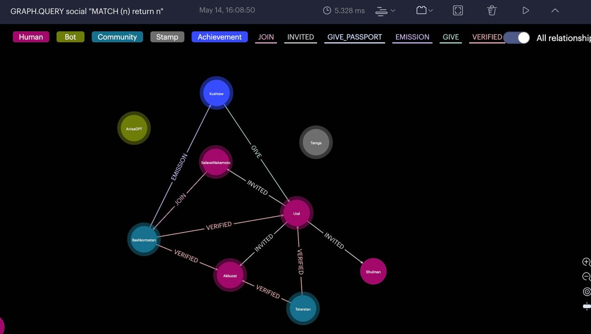
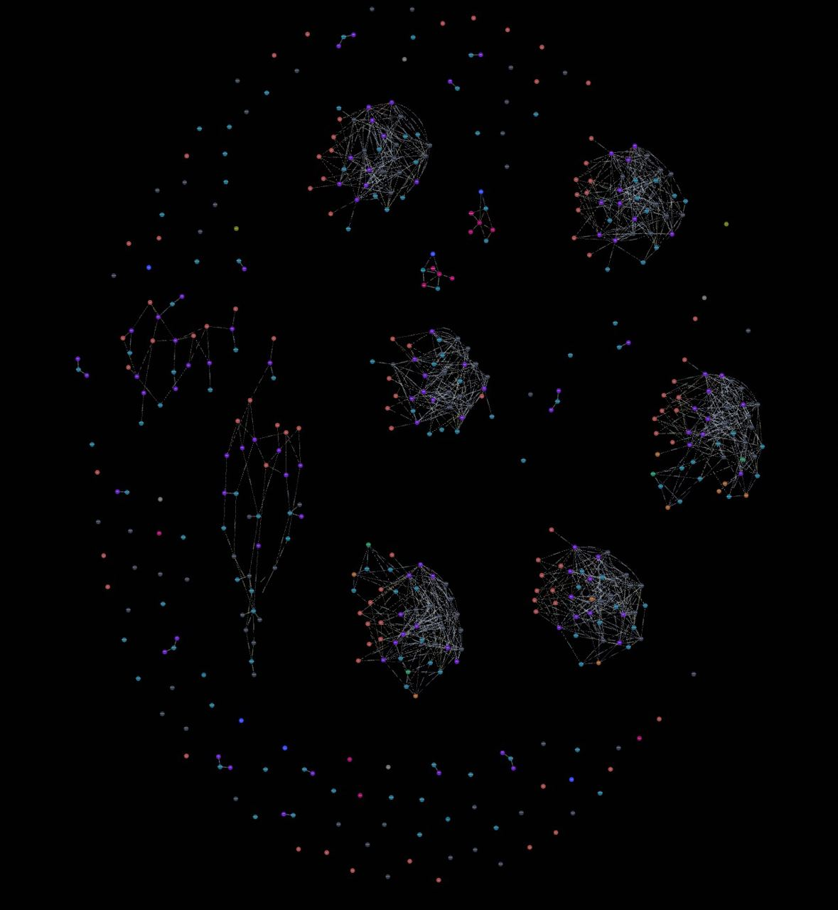

# CommoBackend

The backend is built using Python with fastapi+Django framework.
Key features of the project include:

* User and community entity relationship graph.
* Community Geo map.
* Chatbot interface using OpenAI's ChatGPT API.
* Django administration panel.
* API for integration with other services.
* Verification through an external service, CommoID.
* Automation of processes between external services, such as emails, social media posting, and sending emails through n8n.

## Backend dirs Structure
    api: FastAPI routers
    models: Django ORM
    schemas: FastAPI Pydantic models
    graphs: Redis Stack for Graph DB

# Demo Graph

    * siple graph: back/graphs/make_community.py

# Other

* Telegram bot + ChatGPT openApi - /bots
* N8N for autotask - n8n.yaml

